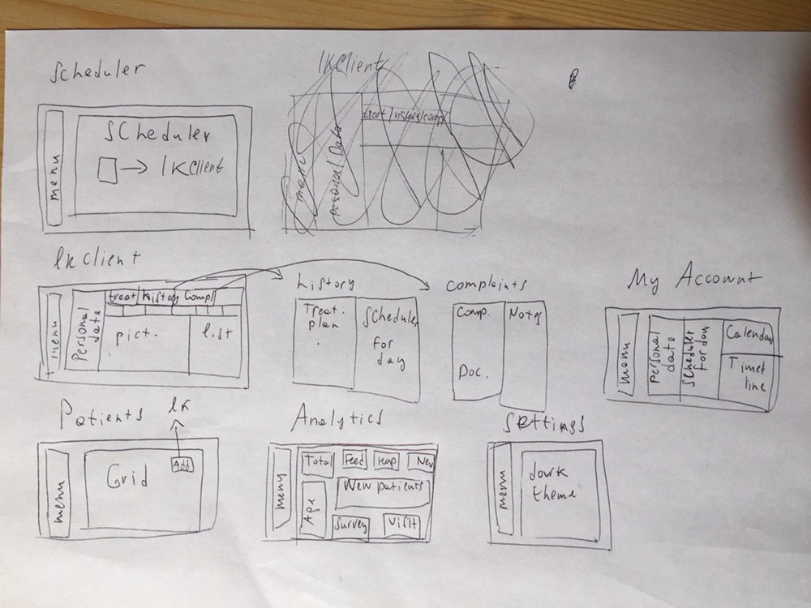

# API 
## Return list clients for "Patients" table
## Request
* ## Method
```sh
GET
```
* ## URL
```sh
/api/clients
```
## Response array object
| Parameter | Type   |
|-----------|--------|
| _id       | string |
| name      | string |
| lastname  | string |
| birthday  | date   |
| phone     | string |
## Response example
```sh
[
  {
    "_id": string,
    "name": string,
    "lastname": string,
    "birthday": date,
    "phone": string,
    "lastAppt": date
  }, {
    "_id": string,
    "name": string,
    "lastname": string,
    "birthday": date,
    "phone": string,
    "lastAppt": date
  }
]
```
#
## Return client by id
## Request
* ## Method
```sh
GET
```
* ## URL
```sh
/api/clients/:id
```
* ## URL Params
```sh
id: string
```
## Response
| Parameter        | Type   |
|------------------|--------|
| name             | string |
| lastname         | string |
| birthday         | date   |
| phone            | string |
| email            | string |
| city             | string |
| address          | string |
| historyTreatment | array  |
| complaints       | array  |

* ## historyTreatment
| Parameter   | Type   |
|-------------|--------|
| startDate   | date   |
| endDate     | date   |
| idTreatment | string |

* ## complaints
| Parameter        | Type        |
|------------------|-------------|
| listComplaints   | arrayString |
| listAllergies    | arraySting  |
| listPreparations | arraySting  |
| listNotes        | array       |
| listDocuments    | array       |

* ## listNotes
| Parameter | Type   |
|-----------|--------|
| textNotes | string |
| dateNotes | date   |

* ## listDocuments
| Parameter     | Type   |
|---------------|--------|
| nameDocuments | string |
| URLDocuments  | string |

## Response example
```sh
{
  "name": string,
  "lastname": string,
  "birthday": date,
  "phone": string,
  "email": string,
  "city": string,
  "address": string,
  "historyTreatment": [{
    "startDate": date,
    "endDate": date,
    "idTreatment": string
  }, {
    "startDate": date,
    "endDate": date,
    "idTreatment": string
  }],
  "complaints": {
    "listComplaints": [
      string, string
    ],
  "listAllergies": [
      string, string
    ],
    "listPreparations": [
      string, string
    ],
  "listNotes": [{
      "textNotes": string,
      "dateNotes": date
    }, {
      "textNotes": string,
      "dateNotes": date
    }],
  "listDocuments": [{
      "nameDocuments": string,
      "URLDocuments": string
    }, {
      "nameDocuments": string,
      "URLDocuments": string
    }]
  }
} 
```
#
## Return list scheduler
## Request
* ## Method
```sh
GET
```
* ## URL
```sh
/api/scheduler/:firstDay&:lastDay
```
* ## URL Params
```sh
firstDay: date
lastDay: date
```
## Response array object
| Parameter | Type   |
|-----------|--------|
| startDate | date   |
| endDate   | date   |
| name      | string |
| lastname  | string |
| phone     | string |
| operation | string |
| location  | string |
| note      | string |
| idClient  | string |
## Response example
```sh
[
  {
    "startDate": date,
    "endDate": date,
    "name": string,
    "lastname": string,
    "phone": string,
    "operation": string,
    "location": string,
    "note": string,
    "idClient": string
  }, {
    "startDate": date,
    "endDate": date,
    "name": string,
    "lastname": string,
    "phone": string,
    "operation": string,
    "location": string,
    "note": string,
    "idClient": string
  }
]
```
#
## Return list treatment
## Request
* ## Method
```sh
 GET
```
* ## URL
```sh
/api/treatment
```
## Response array object
| Parameter     | Type   |
|---------------|--------|
| nameType      | string |
| listProcedure | array  |
### listProcedure
| Parameter   | Type    |
|-------------|---------|
| name        | string  |
| cost        | integer |
| idProcedure | string  |
## Response example
```sh
[
  {
    "typeName": string,
    "listProcedure": [{
      "name": string,
      "cost": integer,
      "idProcedure": string
    }, {
      "name": string,
      "cost": integer,
      "idProcedure": string
    }]
  }, {
    "typeName": string,
    "listProcedure": [{
      "name": string,
      "cost": integer,
      "idProcedure": string
    }, {
      "name": string,
      "cost": integer,
      "idProcedure": string
    }]
  }]
  }
]
```
#
## Пока его не вызывай, это надо будет обсудить потом вместе
## Return doctor by id
## Request
* ## Method
```sh
GET
```
* ## URL
```sh
/api/doctors/
```
* ## GET body Params
```sh
login: string
password: string
```
## Response array object
| Parameter | Type   |
|-----------|--------|
| name      | string |
| lastname  | string |
| birthday  | date   |
| phone     | string |
| email     | string |
| city      | string |
| address   | string |
## Response example
```sh
[
  {
    "_id": string,
    "name": string,
    "lastname": string,
    "birthday": date,
    "phone": string,
    "email": string,
    "city": string,
    "address": string
  } 
]
```
#
## Return "Age of patient" dashboard
## Request
* ## Method
```sh
GET
```
* ## URL
```sh
/api/analytics/age
```
## Response array object
| Parameter | Type    |
|-----------|---------|
| ageJunior | integer |
| ageMiddle | integer |
| ageSenior | integer |
## Response example
```sh
[
  {
    "ageJunior": integer,
    "ageMiddle": integer,
    "ageSenior": integer
  } 
]
```
#
## Return "New patient" dashboard
## Request
* ## Method
```sh
GET
```
* ## URL
```sh
/api/analytics/new/:type
```
* ## URL Params
```sh
type: string
type = ['years', 'month', 'week']
```
## Response array object 
| Parameter | Type  |
|-----------|-------|
| list      | array |
* ## listMonth
| Parameter | Type    |
|-----------|---------|
| name      | string  |
| num       | integer |
## Response example
```sh
[
  {
    "list": [{
      "name": string,
      "num": integer
    }, {
      "name": string,
      "num": integer
    }]
  } 
]
```
#
## Return "Hospital survey" dashboard
## Request
* ## Method
```sh
GET
```
* ## URL
```sh
/api/analytics/hospital/:type
```
* ## URL Params
```sh
type: string
type = ['years', 'month', 'week']
```
## Response array object 
| Parameter | Type  |
|-----------|-------|
| list      | array |
* ## listMonth
| Parameter | Type    |
|-----------|---------|
| name      | string  |
| num       | integer |
## Response example
```sh
[
  {
    "list": [{
      "name": string,
      "num": integer
    }, {
      "name": string,
      "num": integer
    }]
  } 
]
```
#
## Return "Visit patients" dashboard
## Request
* ## Method
```sh
GET
```
* ## URL
```sh
/api/analytics/visit/:type
```
* ## URL Params
```sh
type: string
type = ['years', 'month', 'week']
```
## Response array object 
| Parameter | Type  |
|-----------|-------|
| list      | array |
* ## listMonth
| Parameter | Type    |
|-----------|---------|
| name      | string  |
| num       | integer |
## Response example
```sh
[
  {
    "list": [{
      "name": string,
      "num": integer
    }, {
      "name": string,
      "num": integer
    }]
  } 
]
```
#
## Return "Total patients" dashboard
## Request
* ## Method
```sh
GET
```
* ## URL
```sh
/api/analytics/total/
```
## Response array object 
| Parameter | Type  |
|-----------|-------|
| list      | array |
* ## listMonth
| Parameter | Type    |
|-----------|---------|
| name      | string  |
| num       | integer |
## Response example
```sh
[
  {
    "list": [{
      "name": string,
      "num": integer
    }, {
      "name": string,
      "num": integer
    }]
  } 
]
```
#
## Delete clients
## Request
* ## Method
```sh
DELETE
```
* ## URL
```sh
/api/clients
```
* ## BODY Params
```sh
id: string
```
## Response example
```sh
{
  type: 'OK'
}
```
#
## Delete scheduler
## Request
* ## Method
```sh
DELETE
```
* ## URL
```sh
/api/scheduler
```
* ## BODY Params
```sh
id: string
```
## Response example
```sh
{
  type: 'OK'
}
```
#
## Create clients
## Request
* ## Method
```sh
POST
```
* ## URL
```sh
/api/clients
```
* ## BODY Params
```sh
name: string
lastname: string
birthday: string
phone: sting
email: string
city: string
address: string
```
## Response example
```sh
{
  type: 'OK'
}
```
#
## Create scheduler
## Request
* ## Method
```sh
POST
```
* ## URL
```sh
/api/scheduler
```
* ## BODY Params
```sh
idClient: string
idTreatment: string
startDate: string
endDate: string
location: string
note: string
```
## Response example
```sh
{
  type: 'OK'
}
```
#
## Update client
## Request
* ## Method
```sh
PATCH
```
* ## URL
```sh
/api/clients
```
* ## BODY Params
```sh
_id: string
Any params clients
```
## Response example
```sh
{
  type: 'OK'
}
```
#
## Update complaint
## Request
* ## Method
```sh
PATCH
```
* ## URL
```sh
/api/complaint
```
* ## BODY Params
```sh
idClient: string
Any params complaint
```
## Response example
```sh
{
  type: 'OK'
}
```
#
## Update scheduler
## Request
* ## Method
```sh
PATCH
```
* ## URL
```sh
/api/scheduler
```
* ## BODY Params
```sh
_id: string
Any params scheduler
```
## Response example
```sh
{
  type: 'OK'
}
```

Image Page Project

